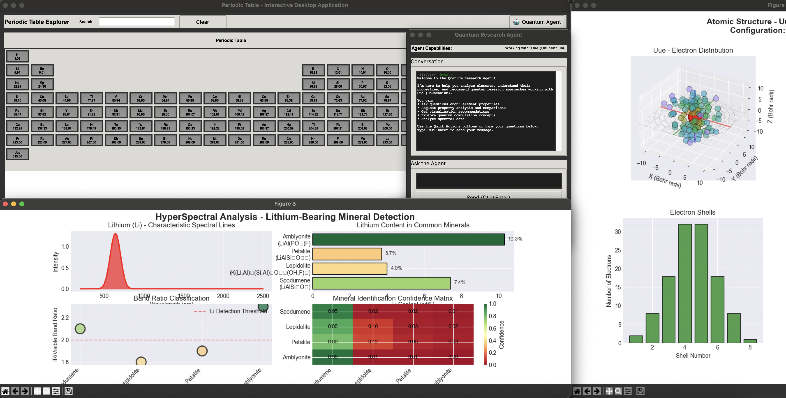

1. Design a comprehensive AI integration plan tailored to a specific business function, or

2. Develop an executive presentation that outlines a transformative, agent-based AI initiative.

3. Support your project with a detailed risk-benefit analysis, cost implications, and measurable KPIs to demonstrate strategic value.
---
Desktop application for interactive periodic table with quantum research integration.

## Getting Started

### Installation

```bash
source venv/bin/activate
```

1. Install required dependencies:
```bash
pip install -r requirements.txt
```

2. Run the application:
```bash
python run_app.py
```

3. Generate analysis reports and visualizations:
```bash
python generate_analysis.py
```

## Application Features

### Main GUI Features
- **Interactive Periodic Table**: Color-coded elements by category (left panel)
- **Search Functionality**: Search elements by name, symbol, or category
- **Element Details**: View comprehensive information for each element (right panel)
- **Visualization Panel**: 10 visualization buttons with horizontal scrolling (bottom panel)
- **Responsive Design**: Minimum 1000×800px, works on all screen sizes
- **Multi-Element Support**: Select single or multiple elements for analysis

### Implemented Features

✓ **Interactive GUI (tkinter)**
- Elements grid with CPK color coding (left panel)
- Real-time search functionality
- Click to view detailed element information (right panel)
- Multi-element selection support
- Responsive 3-frame layout (top/middle/bottom)

✓ **3D Visualizations** (4 methods)
- Interactive 3D atomic structure visualization
- Ionization energy visualization
- Electron shell structure visualization
- Thermal properties visualization

✓ **HyperSpectral Analysis** (3 methods)
- Spectral signature visualization (200-2500nm wavelength range)
- Band ratio analysis for IR and visible wavelengths
- Minimum wavelength mapping for element identification

✓ **Analysis Visualizations** (3 methods)
- Lithium-bearing mineral detection (4-panel analysis)
- Periodic table heatmap by element properties
- Property distribution charts and histograms

✓ **Visualization Organization**
- 10 buttons organized into 3 logical groups (3D, HyperSpectral, Analysis)
- Horizontal scrolling canvas for small screens
- Mousewheel support for smooth scrolling
- Single-click access to any visualization

✓ **Resizable Element Details Panel**
- Drag divider between periodic table and element details to adjust width
- Periodic table minimum: 400px, Element details minimum: 250px
- Default widths: 700px periodic table, 300px element details
- Smooth, responsive dragging with visual feedback
- Works across all screen sizes

✓ **Element Comparison**
- Compare up to multiple elements side-by-side
- Compare properties across selected elements
- Visual property distribution analysis

✓ **Analysis Report Generator**
- Generate comprehensive PDF analysis report
- Create individual PNG visualizations
- Export element data to CSV
- Statistical summary generation

✓ **Quantum Integration Framework**
- Quantum research agent structure
- Job submission and tracking
- Framework for Azure Quantum integration
- Support for quantum state analysis

### Upcoming Features & Roadmap

#### Phase 1: UI/UX Polish & Cleanup ✅ COMPLETED
- [x] Remove Visualization tab from Element Details panel
  - Visualizations now accessible from dedicated bottom panel
  - Reduces clutter in details window
  - Improves focus on element properties
  
- [x] Modern responsive UI redesign
  - Implement adaptive layout for multiple screen sizes
  - Periodic table scaling based on available space
  - Responsive font sizing and element sizing
  - Mobile-friendly breakpoints (small/medium/large)
  - Flexible frame proportions
  - Screen size detection: <1000px (small), 1000-1400px (medium), >1400px (large)

- [x] Fix 3D atomic structure grid positioning
  - Grid now stationary in world coordinates
  - Only atom model repositions during rotation/pan
  - Improves visualization clarity and spatial orientation
  - Better visual reference while manipulating model
  - Added fixed grid plane and axis reference lines

#### Phase 2: Agent/AI Assistant Integration ✅ COMPLETED
- [x] Accessible Quantum Research Agent interface
  - Popup dialog for conversational AI access
  - Context-aware suggestions based on selected element
  - History/conversation tracking
  - Clean chat-based interface
  - Quick Action buttons for common tasks

- [x] Agent capabilities
  - Element property analysis and insights
  - Visualization recommendations
  - Quantum computation assistance
  - Spectroscopic information
  - Element comparison suggestions
  - Responsive to user queries with contextual answers

#### Phase 3: Advanced Visualization Enhancements
- [ ] Embedded matplotlib canvas in GUI (real-time preview)
- [ ] Interactive visualizations with hover data
- [ ] Batch visualization export (multiple elements, multiple visualizations)
- [ ] Animation support for molecular dynamics
- [ ] Interactive property sliders for real-time filtering
- [ ] 3D model improvements:
  - Bohr Model 3D (interactive GLB viewer)
  - de Broglie Wave (canvas animation)
  - Schrödinger Wave (probability visualization)
  - Orbital shape rendering (s, p, d, f orbitals)
  - Molecular geometry predictions
  - Energy distribution visualizations

#### Phase 4: Extended HyperSpectral Analysis
- [ ] Additional mineral detection algorithms
- [ ] Reflectance spectrum modeling
- [ ] Absorption edge analysis
- [ ] Multi-element spectral composition analysis
- [ ] Real-time spectral comparison tools

#### Phase 5: Enhanced Database Features
- [ ] Database integration for extended properties
- [ ] Wikipedia integration for element information
- [ ] Historical discovery data and timelines
- [ ] Industrial applications database
- [ ] Element similarity recommendations based on properties

#### Phase 6: Quantum Integration
- [ ] Bridge frontend actions to quantum operations
- [ ] Quantum State Analysis on Azure Quantum
- [ ] Automated QIR code generation for quantum operations
- [ ] Azure Quantum provider selection (IonQ, Quantinuum, etc.)
- [ ] Direct quantum hardware submission from GUI

#### Phase 7: Quantum Research Agent
- [ ] Electron orbital simulations with agent guidance
- [ ] Molecular structure analysis and recommendations
- [ ] Binding energy calculations
- [ ] Material property characterization
- [ ] Real-time quantum state visualization
- [ ] Automated research workflow generation

#### Phase 8: Advanced Analysis Tools
- [ ] Element property correlation analysis
- [ ] Predictive property modeling
- [ ] Drag-and-drop element combination analysis
- [ ] Generate comprehensive analysis reports (PDF)
- [ ] Batch PNG visualization export
