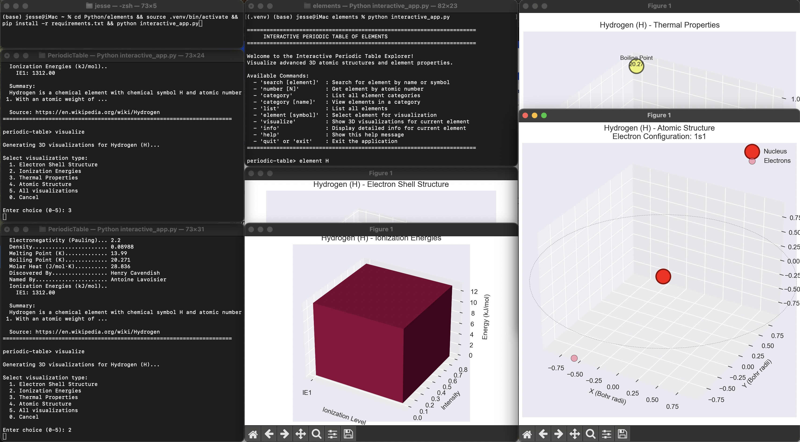

# Interactive Periodic Table of Elements

A comprehensive interactive application for exploring the periodic table with advanced 3D visualizations and detailed element analysis.

## Features

### 🎨 Interactive Interface
- **Search Elements**: Find elements by name, symbol, or atomic number
- **Element Categories**: Browse all element types (metals, nonmetals, noble gases, etc.)
- **Detailed Information**: View comprehensive data for each element
- **Real-time Selection**: Select elements and immediately access their data

### 📊 3D Visualizations
- **Electron Shell Structure**: 3D visualization of electron orbital shells
- **Ionization Energies**: 3D bar chart of successive ionization energies
- **Thermal Properties**: 3D scatter plot of melting point, boiling point, and density
- **Atomic Structure**: 3D model of electrons around the nucleus based on electron configuration
- **Periodic Table Heatmap**: Color-coded periodic table by various properties

### 📈 Data Analysis
- **Statistical Reports**: Comprehensive statistics on element properties
- **Distribution Analysis**: Histograms, pie charts, and bar plots
- **Comparative Visualizations**: Compare elements across multiple properties
- **Correlation Analysis**: Understand relationships between element properties

### 🛠️ Technologies Used
- **pandas**: Data manipulation and analysis
- **numpy**: Numerical computations
- **matplotlib**: 2D and 3D plotting
- **scipy**: Scientific computing and statistics
- **seaborn**: Statistical data visualization
- **plotly**: Interactive web-based visualizations (optional)

## Installation

### Requirements
- Python 3.7 or higher
- pip or conda

### Setup

1. **Install dependencies:**
   ```bash
   pip install -r requirements.txt
   ```

2. **Verify data files:**
   Make sure `Periodic-Table-JSON/PeriodicTableJSON.json` is in the project directory.

## Usage

### Interactive Application

Run the interactive periodic table explorer:

```bash
python interactive_app.py
```

#### Commands:

| Command | Description |
|---------|-------------|
| `search [element]` | Search for element by name or symbol |
| `number [N]` | Get element by atomic number |
| `element [symbol]` | Select element for visualization |
| `info` | Display detailed info for current element |
| `category` | List all element categories |
| `category [name]` | View elements in a category |
| `list` | List all elements |
| `visualize` | Show 3D visualizations for current element |
| `help` | Show help message |
| `quit` or `exit` | Exit the application |

#### Example Session:

```
periodic-table> search hydrogen
Found 1 element(s):
    1. Hydrogen         (H ) - diatomic nonmetal

periodic-table> element H
======================================================================
  HYDROGEN (H)
======================================================================
  Atomic Number.......................1
  Atomic Mass...........................1.008
  Category..............................diatomic nonmetal
  ... (more properties)

periodic-table> visualize
Generating 3D visualizations for Hydrogen (H)...

Select visualization type:
  1. Electron Shell Structure
  2. Ionization Energies
  3. Thermal Properties
  4. Atomic Structure
  5. HyperSpectral
  6. All visualizations
  0. Cancel

Enter choice (0-5): 4
```

### Analysis Demo

Generate comprehensive analysis reports and visualizations:

```bash
python analysis_demo.py
```

This will:
1. Print a detailed statistical report to the console
2. Generate 9 high-quality PNG visualizations in the `periodic_table_analysis/` directory

#### Generated Visualizations:
1. Atomic mass distribution histogram
2. Elements by category bar chart
3. Phase distribution pie chart
4. Atomic mass vs electronegativity scatter plot
5. Melting vs boiling points analysis
6. Densest elements ranking
7. Elements per period distribution
8. Periodic table heatmap by atomic mass
9. Correlation matrix of element properties

### Using as a Library

Import and use the modules in your own Python code:

```python
from data_loader import PeriodicTableDataLoader
from visualizations import ElementVisualizer

# Load data
loader = PeriodicTableDataLoader('Periodic-Table-JSON/PeriodicTableJSON.json')
element = loader.get_element_by_symbol('Au')

# Create visualizations
visualizer = ElementVisualizer()
visualizer.plot_atomic_structure_3d(element)
visualizer.plot_ionization_energies_3d(element)
visualizer.plot_thermal_properties_3d(element)
```

## Project Structure

```
elements/
├── interactive_app.py           # Main interactive application
├── data_loader.py               # Data loading and processing
├── visualizations.py            # 3D visualization generation
├── analysis_demo.py             # Analysis and reporting script
├── requirements.txt             # Python dependencies
├── README.md                    # This file
└── Periodic-Table-JSON/
    ├── PeriodicTableJSON.json   # Element data
    ├── PeriodicTableCSV.csv     # CSV format
    └── ... (other data files)
```

## Module Documentation

### data_loader.py

**PeriodicTableDataLoader**
- `get_dataframe()`: Get all elements as pandas DataFrame
- `get_element_by_symbol(symbol)`: Retrieve element by chemical symbol
- `get_element_by_number(number)`: Retrieve element by atomic number
- `get_element_by_name(name)`: Retrieve element by name
- `get_all_elements()`: Get list of all elements
- `get_elements_by_category(category)`: Get elements in specific category
- `get_all_categories()`: Get list of all categories

### visualizations.py

**ElementVisualizer**
- `plot_electron_shells_3d(element)`: Visualize electron shell structure
- `plot_ionization_energies_3d(element)`: Visualize ionization energies
- `plot_thermal_properties_3d(element)`: Visualize thermal properties
- `plot_atomic_structure_3d(element)`: Visualize complete atomic structure
- `plot_element_properties_comparison(elements, property)`: Compare properties across elements
- `plot_electronegativity_heatmap(df)`: Create periodic table heatmap

## Example Analyses

### Find Element Properties
```python
from data_loader import PeriodicTableDataLoader

loader = PeriodicTableDataLoader('Periodic-Table-JSON/PeriodicTableJSON.json')

# Get gold
gold = loader.get_element_by_symbol('Au')
print(f"Density: {gold['density']} g/cm³")
print(f"Melting Point: {gold['melt']} K")
print(f"Atomic Mass: {gold['atomic_mass']} amu")
```

### Compare Element Categories
```python
# Get all noble gases
noble_gases = loader.get_elements_by_category('noble gas')
for element in noble_gases:
    print(f"{element['name']}: Boiling Point = {element['boil']} K")
```

### Statistical Analysis
```python
import pandas as pd

df = loader.get_dataframe()

# Find correlations
density_melt_correlation = df['density'].corr(df['melt'])
print(f"Density-Melting Point Correlation: {density_melt_correlation:.3f}")

# Average atomic mass by phase
avg_mass_by_phase = df.groupby('phase')['atomic_mass'].mean()
print(avg_mass_by_phase)
```

## Data Source

Element data comes from the comprehensive Periodic Table JSON dataset, which includes:
- Atomic properties (number, mass, radius, etc.)
- Physical properties (density, melting/boiling points, etc.)
- Electronic properties (electron configuration, ionization energies, etc.)
- Categorization (metals, nonmetals, etc.)
- Historical information (discovered by, named by, etc.)

## Visualization Examples

### 3D Electron Shell Structure
Shows concentric shells representing electron orbital levels with appropriate electron counts.

### 3D Ionization Energies
Bar chart in 3D showing successive ionization energies needed to remove electrons.

### 3D Thermal Properties
Multi-dimensional visualization of melting point, boiling point, and density relationships.

### 3D Atomic Structure
Realistic 3D model with nucleus (red) and electrons distributed on orbital shells.

## Performance Notes

- The interactive application loads all data into memory for fast access
- 3D visualizations may take a few seconds to render for complex elements
- Analysis demo generates 9 visualizations and may take 1-2 minutes to complete
- Use smaller element sets for faster demo execution

## Troubleshooting

### Data file not found
Ensure `Periodic-Table-JSON/PeriodicTableJSON.json` exists in the project directory.

### Missing dependencies
Run `pip install -r requirements.txt` to install all required packages.

### Visualization issues
- If matplotlib doesn't display: ensure you have a display environment
- On headless systems, add `plt.savefig()` to save instead of display
- Update matplotlib: `pip install --upgrade matplotlib`

### Memory issues
For very large analyses, use DataFrame filtering to reduce data size:
```python
df_filtered = df[df['atomic_mass'] < 100]  # Elements under 100 amu
```

## Features Roadmap

- [ ] Web-based interactive dashboard (Flask/Django)
- [ ] Interactive Plotly visualizations with hover data
- [ ] Bohr model 3D animation from GLB files
- [ ] Spectral analysis visualization
- [ ] Element similarity recommendations
- [ ] Database integration for extended properties
- [ ] Export reports as PDF

## License

This project uses data from the Periodic-Table-JSON project licensed under Creative Commons Attribution-ShareAlike 3.0 Unported License.

## Contributing

Contributions are welcome! Areas for improvement:
- Additional visualization types
- Web interface development
- Performance optimizations
- Extended element data
- Educational features

## Support

For issues, questions, or suggestions, please check the documentation or create an issue in the project repository.

---

**Created with ❤️ for chemistry and data visualization enthusiasts**
